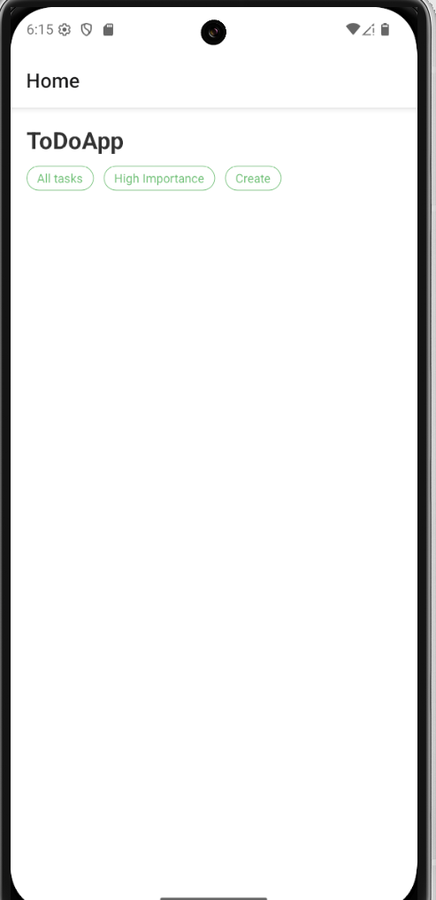
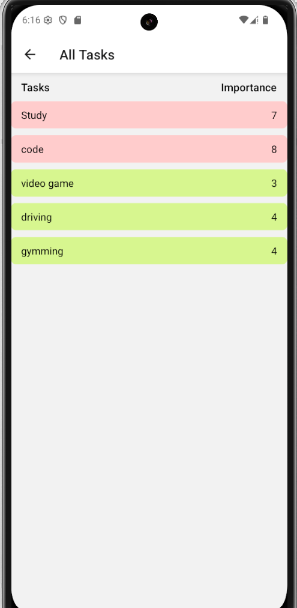
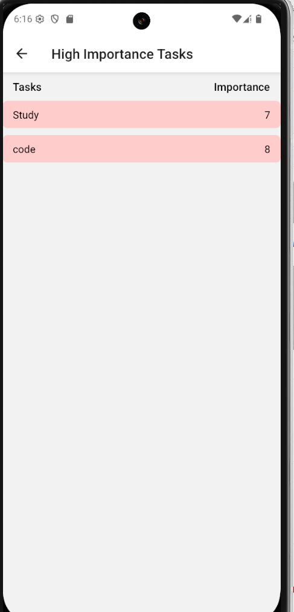
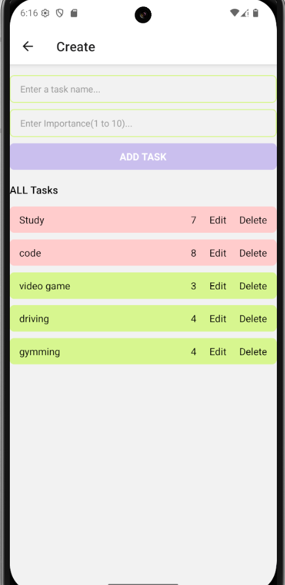

# 📝 To-Do App - React Native

A simple and clean **To-Do app** built with React Native using functional components and hooks like `useState`and using stack navigation to navigate between screens

## 🚀 Features

- ✅ Add tasks with importance level (1 to 10)
- 🖍 Edit existing tasks
- 🗑 Delete tasks
- 🌈 Dynamic background color based on importance
- 📱 Built with React Native CLI
- uses stack navigation to navigate

## 📸 Screenshots
## 1.HOME SCREEN

## 2.ALL TASKS SCREEN

## 3.HIGH IMPORTANCE TASK SCREEN

## 4.CREATE , EDIT AND DELETE SCREEN

